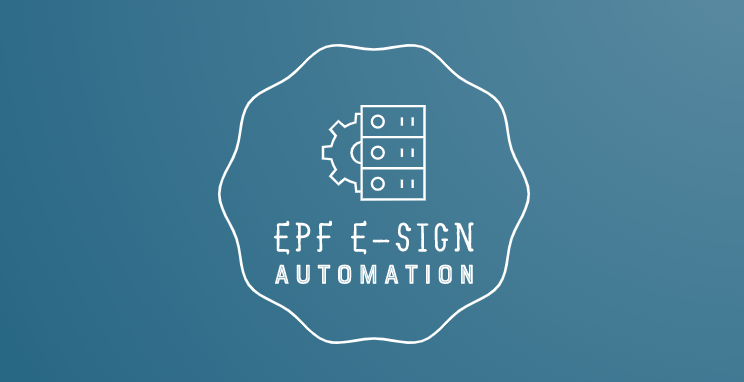

<div align="center">
  </img>
  <br/>
  <br/>
  <p><b><i>EPF Esign Automation</i></b>
  <br/>
  <i>Tool to automate the Esign process for those who had created E-Nomination entry</i>
  </p>

  [Submit an Issue](https://github.com/hemachandsai/epf-esign-automation/issues/new)

</div>
<hr/>

## What is this project for
 - Recently <b>EPFO</b> has made completion of E-Nomination process mandatory for all
 - But the site is quite buggy and un-responsive most of the times. 
 - This projects helps to complete the ESign process through automation without having to go through the hectic process and saves lot of time. It uses [Electron Framework](https://www.electronjs.org/) and [Nightmare](https://github.com/segmentio/nightmare) under the hoods for browser automation. 

## How to use
- Download the latest binary from the [releases section](https://github.com/hemachandsai/epf-esign-automation/releases) depending on the target platform
- Execute the downloaded binary with desired flags or doble click the executable file
```
Usage: epf-esign-automation.exe -u <uan number> -p <password> -a <aadhaar>

Options:
  -V, --version                             output the version number
  -a, --aadhaar <12 digits Aadhaar Number>  Your Aadhaar Number
  -u, --uan <12 digits UAN Number>          Your UAN Number
  -p, --password <Password>                 Your password for EPF website
  -b, --show-browser                        Use this flag if you want to disable headless mode (default: false)
  -s, --silent                              Use this flag to run in silent mode, without notifications (default: false)
  -h, --help                                display help for command
```

## Examples
1. Easiest way is to double click the downloaded binary <b>epf-esign-automation.exe</b> and enter the required details as per the prompt. Below mentioned are more ways to run it. 
1. Run in Headless Mode
    ```
    epf-esign-automation.exe -u <uan number> -p <password> -a <aadhaar>
    ```
1. Run with visible browser window
    ```
    epf-esign-automation.exe -u <uan number> -p <password> -a <aadhaar> -b
    ```
